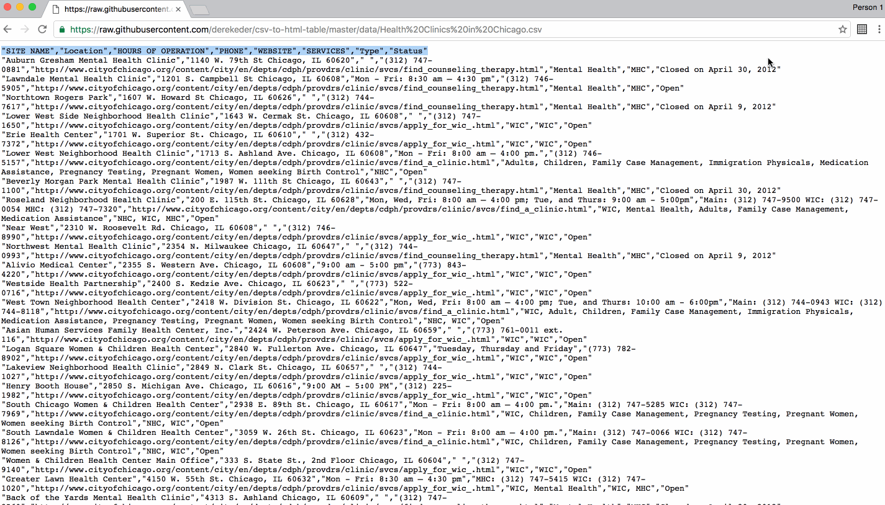

# csv2table
> Easily convert static CSV from a web page to an HTML table.



## Installation

OS X, Linux, and Windows:

```sh
git clone git@github.com:tgaeta/csv2table.git
```

## Development setup

Clone repo > Enable 'Developer Mode' in chrome://extensions/ > Load the extension into Chrome

## Release History

* 0.1.0
    * CHANGE: Updated README.md
* 0.0.1
    * Initial release

## Contributing

The source is hosted on [GitHub](https://github.com/tgaeta/csv2table) and pull requests are welcome.

## License

For copyright status of the "CSVToArray" code, please see [Ben Nadel's Parsing CSV Strings With Javascript Exec() Regular Expression Command Tutorial](https://www.bennadel.com/blog/1504-ask-ben-parsing-csv-strings-with-javascript-exec-regular-expression-command.htm). Everything else is:

Copyright (C) 2017 [Tony Gaeta](https://github.com/tgaeta)

This program is free software: you can redistribute it and/or modify
it under the terms of the GNU General Public License as published by
the Free Software Foundation, either version 3 of the License, or
(at your option) any later version.

This program is distributed in the hope that it will be useful,
but WITHOUT ANY WARRANTY; without even the implied warranty of
MERCHANTABILITY or FITNESS FOR A PARTICULAR PURPOSE.  See the
GNU General Public License for more details.

You should have received a copy of the GNU General Public License
along with this program.  If not, see <http://www.gnu.org/licenses/>.

